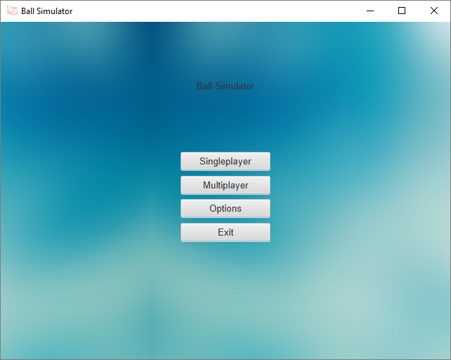
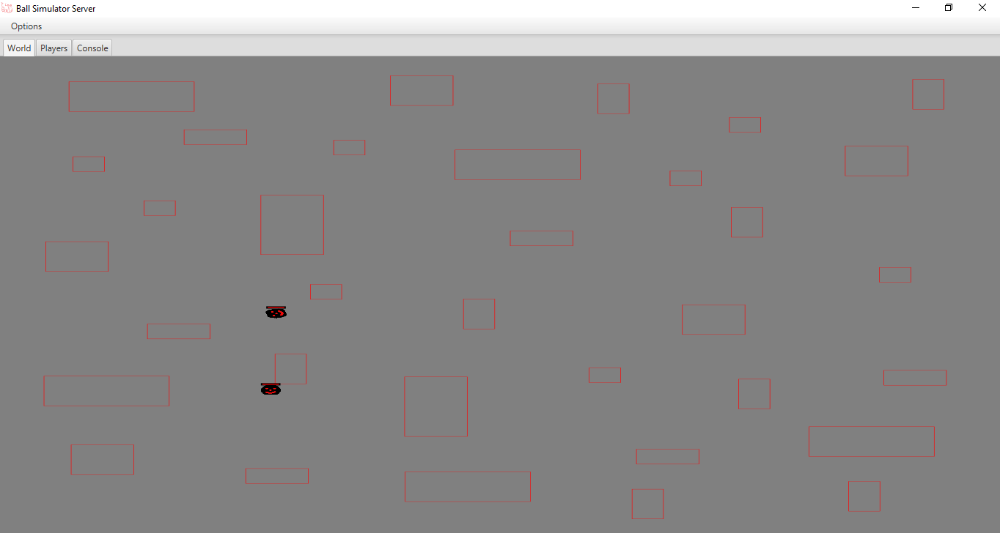
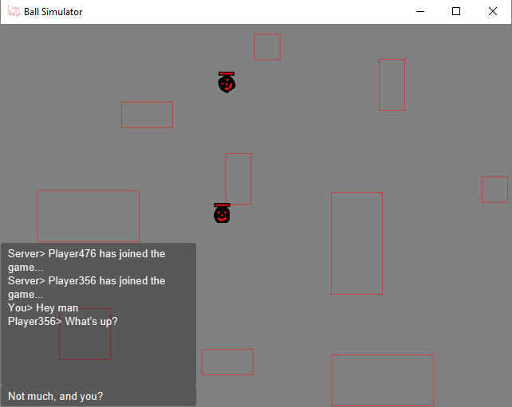
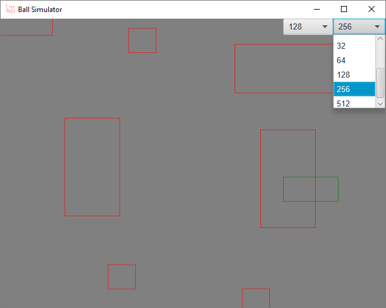
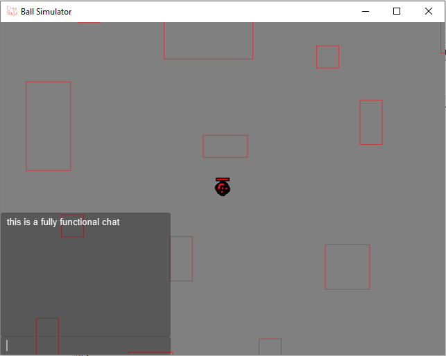

# Ball-Simulator

Very basic 2D, physics-based game about a bouncing, rolling circle that traverses some obstacles. Supports multiplayer, fullscreen, and creation of own terrain (a.k.a obstacles).

Features include:
* 	JavaFX GUI  

* 	Scaling GUI  

*	Fullscreen (Adjustable resolution coming soon!)
* 	Server with optional GUI  

* 	Multiplayer  

*	Custom terrain creation  

*	Bouncing  

*	Rolling