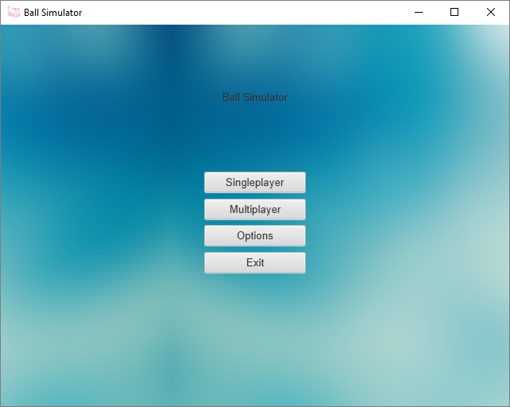
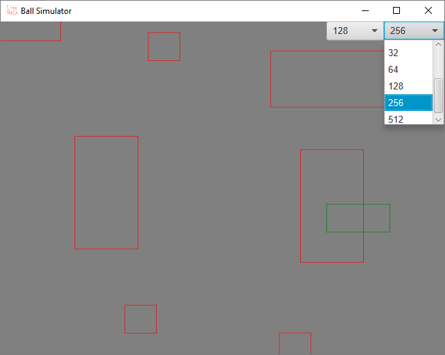

# Ball-Simulator

Very basic 2D, physics-based game about a bouncing, rolling circle that traverses some obstacles. Supports multiplayer, fullscreen, and creation of own terrain (a.k.a obstacles).

Features include:
* JavaFX GUI  

* Scaling GUI  
.png)
*	Fullscreen (Adjustable resolution coming soon!)
* Server with optional GUI  

* Multiplayer  

*	Custom terrain creation  

*	Bouncing  

*	Rolling
